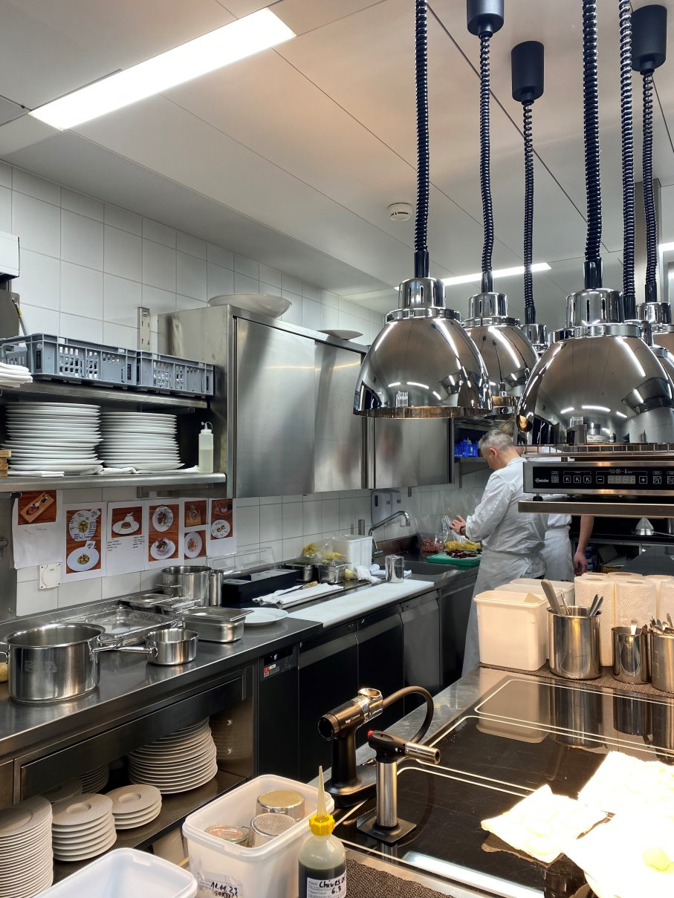

+++
title = "Entwurf Reportage"
date = "2024-04-23"
draft = true
pinned = false
image = ""
+++
<!--StartFragment-->

Sternegastronomie, ein Blick hinter die glänzenden Kulissen

<!--EndFragment-->

 Interview mit dem Sternekoch Stefan Beer und seinem Lehrling Timo Studer im Hotel "Victoria Jungfrau" in Interlaken.

Eine Reportage von **Hannes Keller** 

Der angenehme Duft der Bratensauce liegt in der Luft, während wir durch die gläserne Schiebetür der säuberlich geputzten Küche vom Restaurant "Radius" im Victoria Jungfrau gehen. Das Hotel Victoria Jungfrau ist ein exklusives 5-Sterne Hotel in Interlaken. Das Hotel bietet drei verschiedene Restaurants an, unter anderem "Radius by Stefan Beer", welches ein zentraler Teil des Textes spielt. Zusätzlich gibt es noch andere Bars und Tearooms zur Verpflegung. Konzentration herrscht in der Küche, während die Vorbereitungen für den Abend auf Hochtouren laufen. Verschiedene Gemüse sowie Früchte liegen schön geschnitten in Säckchen zur späteren Verarbeitung parat. Der Lehrling Timo Studer bereitet in einem kleinen Chromstahlpfännchen die Saucen für die Speisen zu. Andere putzen verschiedene Gemüse und schneiden sie klein. Zur Verwunderung lief im Hintergrund ein englisches Lied, welches aus dem Radio zu hören war und die Stimmung angenehmer machte. Der Küchenchef des Hotels und Sternekoch Stefan Beer offeriert zum Start des Interviews ein Glas Wasser und Kaffee. Das Interview mit ihm zeigte seine breite Erfahrung in der Gastronomie auf und lieferte weitere spannende Einblicke hinter die Kulissen der Spitzenküche. In der Gastronomie ist Stress ein wesentlicher Teil des Alltags. Der Beruf als Sternekoch ist anspruchsvoll, und es bleibt fast keine freie Minute. Ein Arbeitstag in der Gourmetküche kann oft bis zu 13 Stunden dauern. Dazu kommt noch das Vorbereiten und das Aufräumen nach der Arbeit. Die vielen Überstunden werden bei manchen Betrieben nicht abgerechnet, jedoch beim Victoria Jungfrau immer. Die meist abgebrochene Ausbildung ist die des Sternekochs, daher ist es auch klar, dass dieser Stress zu Burnouts führen kann. Nach Beer ist Stress sehr personenabhängig. Für ihn gebe es keinen direkten Stress. Er strebe sehr für seinen Job und wolle immer das Beste, so sei die Arbeit viel leichter und mache ihm Spass. Hätte er aber einen Vorgesetzten, der ihm immer im Nacken sitze, hätte er durchaus mehr Stress. Für ihn sei Stress mehr ein Druck, jedoch brauche er diesen Druck, um seine Ziele zu verfolgen. Beer hat zwei Kinder, und ihm ist es sehr wichtig, dass er die Arbeit und die Familie trennen kann. Er arbeitet von Dienstags bis Samstags. So bleiben ihm zwei Tage, an denen er sich auf die Familie konzentriert. Er lässt dann die Arbeit liegen und unternimmt gerne Aktivitäten mit den Kindern und seiner Frau. Oft gehen sie spazieren, und so findet er eine gute Balance zwischen Arbeit und Freizeit.