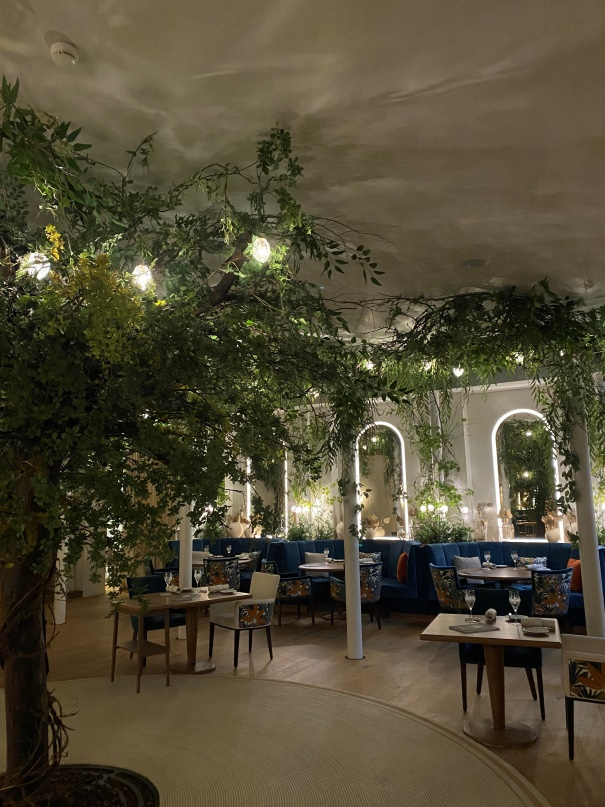

+++
title = "Reportage Hannes Keller"
date = "2024-04-26"
draft = false
pinned = false
image = ""
+++
<!--StartFragment-->

Sternegastronomie, ein Blick hinter die glänzenden Kulissen

<!--EndFragment-->

 Reportage mit dem Sternekoch Stefan Beer und seinem Lehrling Timo Studer im Hotel "Victoria Jungfrau" in Interlaken. 

Eine Reportage von **Hannes Keller und Aline Roth** 

Der angenehme Duft der Bratensauce liegt in der Luft, während wir durch die gläserne Schiebetür der säuberlich geputzten Küche vom Restaurant "Radius" im Victoria Jungfrau gehen. Das Hotel Victoria Jungfrau ist ein exklusives 5-Sterne Hotel in Interlaken. Das Hotel bietet drei verschiedene Restaurants an, unter anderem "Radius by Stefan Beer", welches ein zentraler Teil des Textes spielt. Zusätzlich gibt es Bars und Tearooms zur Verpflegung. Konzentration herrscht in der Küche, während die Vorbereitungen für den Abend auf Hochtouren laufen. Verschiedene Gemüse sowie Früchte liegen schön geschnitten in Säckchen zur späteren Verarbeitung parat. Der Lehrling Timo Studer bereitet in einem kleinen Chromstahlpfännchen die Saucen für die Speisen zu. Weitere Mitarbeiter putzen verschiedene Gemüse und schneiden sie klein. Zur Verwunderung lief im Hintergrund ein englisches Lied, welches aus dem Radio zu hören war und die Stimmung angenehmer machte. Der Küchenchef des Hotels und Sternekoch Stefan Beer offeriert zum Start des Interviews ein Glas Wasser und Kaffee. Das Interview mit ihm zeigte seine breite Erfahrung in der Gastronomie auf und lieferte weitere spannende Einblicke hinter die Kulissen der Spitzenküche. In der Gastronomie ist Stress ein wesentlicher Teil des Alltags. Der Beruf als Sternekoch ist anspruchsvoll, und es bleibt fast keine freie Minute. Ein Arbeitstag in der Gourmetküche kann oft bis zu 13 Stunden dauern. Dazu kommt noch das Vorbereiten und das Aufräumen nach der Arbeit. Die vielen Überstunden werden bei manchen Betrieben nicht abgerechnet, jedoch beim Victoria Jungfrau immer. Die meist abgebrochene Ausbildung ist die des Sternekochs, daher ist es auch klar, dass dieser Stress zu Burnouts führen kann. Nach Beer ist Stress sehr personenabhängig. Für ihn gebe es keinen direkten Stress. Er strebe sehr für seinen Job und wolle immer das Beste, so sei die Arbeit viel leichter und mache ihm Spass. Hätte er aber einen Vorgesetzten, der ihm immer im Nacken sitze, hätte er durchaus mehr Stress. Für ihn sei Stress mehr ein Druck, jedoch brauche er diesen Druck, um seine Ziele zu verfolgen. Beer hat zwei Kinder, und ihm ist es sehr wichtig, dass er die Arbeit und die Familie trennen kann. Er arbeitet von Dienstags bis Samstags. So bleiben ihm zwei Tage, an denen er sich auf die Familie konzentriert. Er lässt dann die Arbeit liegen und unternimmt gerne Aktivitäten mit den Kindern und seiner Frau. Oft gehen sie spazieren, und so findet er eine gute Balance zwischen Arbeit und Freizeit.



Guide Michelin/Gault Millau 

Die erste Auflage der Guide Michelin, die 1900 von André und Édouard Michelin veröffentlicht wurde, war ein Werkstattwegweiser, in dem Tipps zum Umgang mit dem Auto und den Rädern gegeben wurden. 23 Jahre später kam erstmals eine Auflage heraus, in der es um Hotels und Restaurants ging, vorerst aber nur in Frankreich. 1926 vergab dann das Magazin Guide Michelin erstmals Sterne. Die Restauranttester, sogenannte Inspektoren, sind anonym und der Gastronom erfährt seine Bewertung erst, wenn sein Restaurant in der neuen Auflage des Guide Michelin erscheint. Insgesamt kann ein Restaurant mit bis zu 3 Sternen ausgezeichnet werden. Im Gegensatz zu Michelin befasst sich Gault-Millau schon immer mit dem Gastrobereich. 1969 brachten die Journalisten Henri Gault (1929–2000) und Christian Millau (1928–2017) ein Magazin über Tipps zu Restaurants heraus. 1982 wurde es dann das erste Mal in der Schweiz veröffentlicht. Die Höchstpunktzahl, die erreicht werden kann, sind 20 Punkten. 11 Punkte beschreiben eine durchschnittlichen Küche. Aktuell haben die weltbesten Restaurants 19.5 Punkte. In der gesamten Geschichte erreichten nur zwei Restaurants die Note 20.



"Ich glaube nicht, dass man sich einmal entscheidet, Sternkoch zu werden"

In Stefan Beers Jugend hatten seine Eltern ein einfaches Dorfrestaurant, also bekam er gelegentlich Einblick in die Küche. An Tagen, an denen das Restaurant sehr voll war, schickten ihn seine Eltern zu seinem Onkel und seiner Tante aufs Land. Diese hatten einen Bauernhof mit Gemüse und Obst, und so entdeckte er die Liebe zu den Grundnahrungsmitteln. Diese Produkte spielen heute im Restaurant Radius eine zentrale Rolle, mehr dazu später. Stefan Beer kam also schon in jungen Jahren in Kontakt mit dem Gastronomiegewerbe. Doch dann kamen die Interessen am Rennradfahren auf, und Stefan Beer stand kurz vor einem Profivertrag. Aufgrund gewisser Umstände klappte das nicht, und er entschied sich zurückzukehren zum Gastronomie. Beer hat den Ehrgeiz und den Wettbewerbsdrang vom Rennradfahren mit in die Küche genommen. "Ich wollte immer das Beste und Größte", sagt Beer. Er hatte den Drang, immer das Beste zu wollen, deshalb ging er auch ins Ausland, in die besten Hotels in den grössten Metropolen. "Ich wollte immer mehr und mehr." Beer ist Küchenchef im gesamten Hotel Victoria, daher trägt er die volle Verantwortung. Für Beer bleibt nebst seinem anspruchsvollen Beruf nicht viel Freizeit übrig, auch Überstunden sind Teil seines Alltags. Dazu hat er eine Frau und eine neun Jährige Tochter und einen zwölf Jährigen Sohn, was eine grosse Herausforderung ist. " Wenn ich Zuhause bin, dann bin ich Zuhause" sagte Beer, er sei dann nur mit seiner Familie zusammen und gehe nicht mit Kollegen essen oder sonstiges. Laut Beer gäbe es ihn und den Job und ihn und seine Familie und das müsse getrennt bleiben, denn wenn es Probleme in der Familie gibt, dürfen die sich nicht auf seinen Arbeit übertragen und auch umgekehrt nicht. Man müsse sich die Zeit sehr genau einteilen sonst habe man früher oder später Probleme." Es gibt auch Zeiten in denen ich nicht mehr kann, wenn viel Zuhause läuft und ich viel arbeiten muss" so Beer. Er habe jeden Sonntag und jeden Montag frei, ausser wenn Festtage sind, kann es auch sein, dass er am Sonntag arbeiten muss.

Timo Studer, Lehrling im Jungfrau Victoria

Timo Studer ist 18 Jahre alt und wohnt  bei seinen Eltern in Unterseen. Er hat vom guten Ruf des Victoria Jungfrau gehört und hatte zudem schon immer ein grosses Interessen am Kochen. Ein Kollege seines Vaters hat ihm das Hotel als ideale Lehrstelle empfohlen. Nach dem Timo Studer im Victoria Jungfrau geschnuppert hat bekam er schliesslich die Lehrstelle als Koch. Bezüglich seiner Freizeit äusserte er : "Ich habe tatsächlich ziemlich viel Freizeit, da ich erst am Nachmittag mit der Arbeit beginne. Mein Morgen ist daher meistens frei". Jedoch ist sein Privatleben durch die Arbeitszeiten eingeschränkt, er arbeite vor allem am Wochenende und habe unter der Woche frei. "Ich musste meine Aktivitäten umplanen, auch das Lernen findet nun eher morgens statt, ebenso wie Sport und andere Freizeitbeschäftigungen. Bezüglich seiner Zukunft sagt Timo Studer, er wolle zuerst die Lehrabschlussprüfung absolvieren und sich dann in diesem Beruf weiterbilden. Langfristig gesehen strebe er an ein eigenes Restaurant zu führen oder als Küchenchef zu arbeiten. "Mein Ziel ist es mich immer weiterzuentwickeln, Neues zu lernen und vor allem die Gäste glücklich zu machen" so Timo.

"Koch des Jahres, aber nicht ohne Team!"

Stefan Beer hat schon während seiner Ausbildung an Wettbewerben teilgenommen und auch gewonnen. Dies zog sich durch sein Leben, da er eine sehr zielstrebige Person ist. Er wurde 2022  „Bilanz Rating“ Koch des Jahres gewählt. Sein Restaurant "Radius" wurde mit 17 Gault-Millau-Punkten und einem Guide-Michelin-Stern ausgezeichnet. Im Interview erläutert er klar deutlich, dass diese Auszeichnungen ohne das Team sicher nicht möglich wären. Er sagt: "Ich stehe zuvorderst und bin quasi die Spitze des Teams". Er kann den Michelin-Stern sowie die Gault-Millau-Punkte nicht alleine verdienen. Dafür, dass ein Restaurant eine Auszeichnung erhalten kann, muss es regelmäßig getestet werden. Während die Tester im Restaurant zu Gast sind, ist im Gegensatz zum Film "Ratatouille" nicht alles ausser Kontrolle und hektisch. Die Restauranttester sind anonym und tauchen ohne Anfrage in einem Restaurant auf. Andere Köche, wie zum Beispiel Alain Bacher, sind der Meinung, dass sich ein Aufenthalt von Testern erahnen lasse, wenn eine Person mit einem französischen Kontrollschild essen gehe und immer sehr viele Fragen stelle. Es wird nicht nur einmal getestet sondern mehrere Male. Dann bekommt das Gasthaus die Auszeichnung. Es gilt: je höher die Auszeichnungen, desto öfter wird getestet. Wie gewonnen können Auszeichnungen aber auch verloren werden. Dies sei aber eher schwierig, da die Sterne und Punkte nicht bei einem schlechten Tag verloren gehen, sondern auf mehrere schwache Leistungen, während einiger Testbesuche, zurückzuführen seien. Ein Verlust der Auszeichnung schadet nicht nur dem Image des Restaurants, sondern bringt auch finanzielle Probleme mit sich. Zum Beispiel bietet ein Restaurant ausgefallene und exklusive Küche an, zieht dieses Kundschaft an, welche bereit ist, einen höheren Preis für ein Menü zu bezahlen. Verliert der Gastronom Punkte oder Sterne, suchen die Gäste sich ein anderes Restaurant auf dem gleichen Preissegment, mit den entsprechenden Anerkennungen. Dadurch verliert das Restaurant nicht nur die Auszeichnung, sondern auch seine Gäste. Das sind die Schattenseiten der Sternengastronomie, was auch wieder darauf hinweist, wie stressig die Branche ist und Fehler nicht unbestraft bleiben.

Ein Restaurant, welches die lokalen Produzenten unterstützt.

Radius by Stefan Beer ist in der Sternengastronomie eher ein ungewöhnliches Restaurant, da alles was auf dem Teller sichtbar ist, im Umkreis von 50km von Interlaken stammt. Beer erklärt, um gewisse Lebensmittel kommt man bei dieser Idee nicht herum. Zum Beispiel Gewürze wie Pfeffer und Curry. Diese können gar nicht in der Schweiz produziert werden. Doch trotzdem steht der lokale Produzent im Vordergrund. "Ich war 10 Jahre im Ausland, in den grössten Metropolen, dort hat man keinen Kontakt zu einem Bauer oder Fischer". Nach dieser Zeit, als er zurück ins Berner Oberland kam, bemerkte er, wie wunderschön die Schweiz mit ihrer Natur wirklich ist, dies war ihm in den jungen Jahren nicht bewusst. Beer begriff, wie schön es ist, in den Bergen zu spazieren und an der frischen Luft zu sein. Sein Ziel war es dann, Zutaten von so nahe wie möglich zu verwenden und den Grossverteiler zu umgehen. Dies ist aber bei einem so grossen Hotel gar nicht so einfach. Trotzdem ist es ihm wichtig, ausgewählte, lokale Gemüseproduzenten wie Bauern und Fischer zu unterstützen. Er verwendet mit seinem Team Kräuter und verschiedene Obstsorten aus dem eigenen Hotelgarten und verwöhnt so seine Gäste.